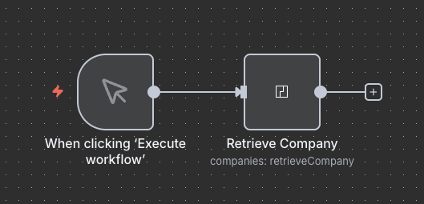
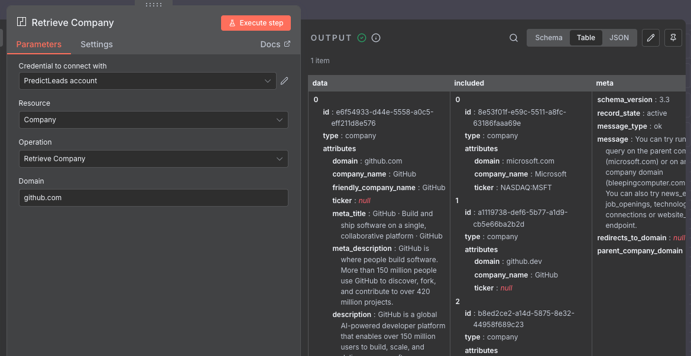

# n8n-nodes-predict-leads

This is an n8n community node. It lets you use PredictLeads data in your n8n workflows.

[PredictLeads](https://predictleads.com/) company intelligence data powers a wide range of business applications, from AI-powered automation to market research and investment analysis.

## Installation

Follow the [installation guide](https://docs.n8n.io/integrations/community-nodes/installation/) in the n8n community nodes documentation.

## Operations

This node supports the following operations:
- retrieve company's data
- retrieve companies' data based on their size and location
- retrieve company's job openings
- retrieve a single job opening
- retrieve a list of job openings based on O*NET codes and location
- retrieve technologies used by a specific company
- retrieve companies using a specific technology
- retrieve all tracked technologies
- retrieve a single technology
- retrieve company's news events
- retrieve a single news event
- retrieve company's financing events
- retrieve company's connections
- retrieve portfolio companies
- retrieve company's website evolution

## Credentials

You must have a PredictLeads API key and token to use this node. You can register for a free account to get your API key and token here:

https://predictleads.com/sign_in

Once registered, you can find your API key and token here:

https://predictleads.com/dashboard

Then you'll need to create credentials in n8n for PredictLeads.

## Compatibility

- Minimum n8n version: 1.84.0
- Verified working with: 1.119.1
- Known issues: None

## Usage

Add PredictLeads node to a workflow.

Configure a basic query and hit "Test step" to get the data.

## API Resources / Search Engines

This node currently only supports the most popular PredictLeads endpoints. If there's an endpoints missing that you would like to use, please let us know at support@predictleads.com

In the meantime, you can also use the [generic HTTP Request node](https://docs.n8n.io/integrations/builtin/core-nodes/n8n-nodes-base.httprequest/) to get the data from other endpoints.

## Related Resources

PredictLeads's complete API documentation is available here:

https://docs.predictleads.com/

## License

[MIT](https://github.com/serpapi/n8n-nodes-serpapi/blob/master/LICENSE.md)